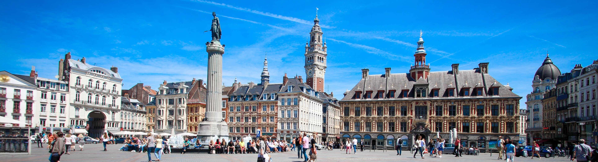

---
listing:
  - id: index-blog
    contents:
      - "blog/*/*.qmd"
      - "blog/*/*.md"
    sort: "date desc"
    type: grid
    max-items: 9
    page-size: 3
    categories: false
    sort-ui: false
    filter-ui: false
    fields: [title, image, description, date]
grid:
  sidebar-width: 0px
  body-width: 1500px
  margin-width: 0px
---

```{r}
source(here::here("_scripts/helpers.R"))
```

::: {.index-logo .column-screen}
```{=html}
<div class="index-logo-libelle">
  <p><strong>A</strong>ssociation <strong>L</strong>illoise</p>
  <p>des <span class="strong-i">i</span>nternes</p>
  <p>de <strong>S</strong>anté <strong>P</strong>ublique</p>
</div>
<div
  class="index-logo-lille"
  role="img"
  aria-label="Symbole de Lille, fleur de lys rouge">
</div>
<div class="index-logo-alisp-social">
  <div class="index-logo-alisp"><p>AL<span class="strong-i">i</span>SP</p></div>
  <div class="index-logo-social">
    `r social_icon(id = "mail", icon = "envelope", title = "Email", set = "fa6-solid")`
    `r social_icon(id = "insta", icon = "instagram", title = "Instagram")`
    `r social_icon(id = "twitter", icon = "x-twitter", title = "X")`
    `r social_icon(id = "facebook", icon = "facebook", title = "Facebook")`
    `r social_icon(id = "linkedin", icon = "linkedin", title = "LinkedIn")`
  </div>
</div>
```
:::

::: {#index-blog}
:::

<!-- \ -->

<!-- ::: {.column-screen style="text-align: center;"}

::: -->
